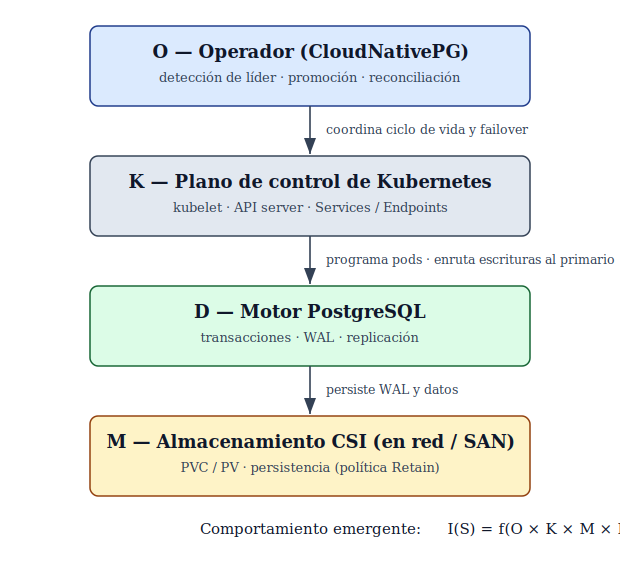

# Análisis Multicapa de Operadores de PostgreSQL y Almacenamiento CSI en Kubernetes: un Marco de Evaluación y su Validación Empírica en CloudNativePG bajo Fallos Inyectados

Angel A. Parejo R., Universidad de Carabobo — Valencia, Estado Carabobo, Venezuela — angelparejo@gmail.com

**Resumen**—La adopción de Kubernetes ha impulsado los operadores de PostgreSQL y la Container Storage Interface (CSI), cuya interacción ante fallos rara vez se evalúa de forma conjunta. Este artículo presenta un marco de análisis multicapa —una taxonomía, un modelo formal S = (O, K, M, D) e invariantes de consistencia, disponibilidad y durabilidad— y lo valida mediante inyección controlada de fallos en un clúster productivo. La validación en profundidad cubre CloudNativePG bajo terminación del primario, indisponibilidad sostenida y partición de red; el contraste con operadores basados en Patroni se aborda de forma analítica. Ninguna transacción confirmada se perdió (RPO nulo) en los tres escenarios. El tiempo de recuperación depende de la visibilidad del fallo ante Kubernetes: la recuperación tras matar el pod primario resulta unas 4.6× más rápida que tras fallarlo de forma sostenida, porque la primera dispara una promoción inmediata y la segunda induce la recreación del pod en su sitio, sin promoción; la partición de red preserva la consistencia sin promover.

**Palabras clave**— Kubernetes, PostgreSQL, CloudNativePG, operadores de bases de datos, CSI, inyección de fallos, arquitecturas nativas de la nube, sistemas distribuidos, consistencia, resiliencia, conmutación por error (failover)

## I. Introducción

Kubernetes se ha convertido en la plataforma de facto para la orquestación de cargas de trabajo en contenedores, incluyendo aplicaciones con estado como las bases de datos [1], [2]. Este avance ha favorecido el desarrollo de operadores de bases de datos, particularmente para PostgreSQL, como un mecanismo para automatizar la gestión del ciclo de vida, la replicación y los procesos de conmutación por error (failover) [5], [14].

En paralelo, la Container Storage Interface (CSI) ha introducido un modelo estandarizado para la integración de sistemas de almacenamiento en Kubernetes, lo que facilita el uso de backends de almacenamiento heterogéneos [3].

A pesar de la madurez de estos componentes, la literatura existente tiende a analizarlos de manera aislada, ya sea desde la perspectiva de la orquestación, la consistencia en sistemas distribuidos o la arquitectura de bases de datos [6], [7], [10].

Sin embargo, diversos estudios han demostrado que aspectos como la consistencia, la resiliencia y la recuperación ante fallos están profundamente influidos por la interacción entre múltiples capas del sistema [8], [9].

En entornos reales, la confiabilidad de un clúster PostgreSQL depende del comportamiento conjunto de la lógica del operador, la planificación de Kubernetes, la semántica de replicación y las garantías del almacenamiento, lo que introduce una dependencia multicapa que aún no ha sido suficientemente explorada en la literatura.

Este acoplamiento adquiere especial relevancia bajo condiciones de fallo, donde pequeñas variaciones en el comportamiento del almacenamiento pueden traducirse en diferencias marcadas en la recuperación, la pérdida de datos o la consistencia observable.

El argumento central de este artículo es que la confiabilidad de las cargas con estado en Kubernetes debe entenderse como un problema inherentemente multicapa. Aunque un operador de PostgreSQL puede implementar una lógica de control correcta, su comportamiento de recuperación está condicionado por factores externos como la latencia, la durabilidad, la topología y las características de failover asociadas al backend.

De forma inversa, una capa de almacenamiento bien configurada no garantiza por sí misma un comportamiento predecible de la base de datos si no existe alineación con los supuestos del operador y con la semántica de replicación.

En este contexto, este trabajo propone un análisis conjunto del problema descrito y presenta las siguientes contribuciones:

- Se propone una taxonomía de operadores de PostgreSQL y de sistemas de almacenamiento basados en CSI en entornos Kubernetes.
- Se define un marco formal de evaluación que integra criterios de resiliencia, consistencia, rendimiento y dependencia multicapa.
- Se introduce un modelo de interacción multicapa que describe cómo la lógica del operador, la semántica de la base de datos y el almacenamiento respaldado por CSI determinan el comportamiento del sistema.
- Se establecen invariantes del sistema orientados a caracterizar la corrección en términos de durabilidad, disponibilidad y consistencia.
- Se valida empíricamente el modelo y los invariantes mediante la inyección controlada de fallos sobre un clúster productivo, midiendo RTO, RPO y visibilidad de transacciones para CloudNativePG (Secciones V y VI).

Este trabajo combina una contribución conceptual —el marco formal, la taxonomía y los invariantes— con su validación empírica: las mediciones obtenidas mediante inyección de fallos (Sección VI) contrastan el comportamiento predicho por el modelo con el observado en un entorno productivo. El alcance de esa validación está delimitado por las restricciones del clúster productivo, que se detallan en la Sección V.

## II. Trabajos Relacionados

La literatura relevante se agrupa en tres líneas. La primera, sobre orquestación de clústeres, arranca con sistemas como Borg y Omega, que sentaron las bases de la gestión a gran escala e influyeron en los principios de diseño de Kubernetes [1], [2]. Sobre esa base, la Container Storage Interface (CSI) introduce una abstracción estandarizada para el almacenamiento persistente que facilita integrar backends heterogéneos [3], y los enfoques declarativos para sistemas stateful han puesto de relieve el patrón operator y la lógica de reconciliación como mecanismo de control [5].

La segunda línea, sobre bases de datos distribuidas, ha tratado con amplitud la consistencia, la resiliencia y la tolerancia a fallos. Sistemas como CockroachDB evidencian el papel de la replicación en entornos distribuidos, mientras que el teorema CAP fija los límites entre consistencia, disponibilidad y tolerancia a particiones [4], [6], [7]. Trabajos posteriores profundizan en modelos de consistencia —incluida la verificación formal de la consistencia eventual fuerte [8]— y en enfoques probabilísticos para evaluar la resiliencia bajo fallos [9].

La tercera línea aborda recuperación, replicación y rendimiento en bases de datos. Los estudios basados en Write-Ahead Logging (WAL) destacan su papel en la durabilidad y la recuperación [11], [12], y las evaluaciones de estrategias de replicación muestran su impacto en la calidad del failover y en la latencia de propagación [13]. Más recientemente, el despliegue de bases de datos en Kubernetes mediante operadores ha ganado atención [14], [15]. Santos et al. [15], por ejemplo, despliegan PostgreSQL sobre Kubernetes con orientación a operaciones serverless y escalado, pero centran su evaluación en el rendimiento y la elasticidad bajo carga, sin caracterizar el comportamiento de failover, consistencia y durabilidad ante fallos inyectados —precisamente el foco de este trabajo.

Una cuarta vertiente, de carácter metodológico, es la verificación empírica de la resiliencia y la consistencia mediante la inyección controlada de fallos. El chaos engineering propone experimentar deliberadamente con fallos para exponer debilidades del sistema antes de que se manifiesten sin control [16]; la metodología asociada al framework Jepsen ha establecido un referente para verificar las garantías de consistencia de sistemas distribuidos bajo fallo, en particular bajo particiones de red [17]. Estudios empíricos sobre fallos de partición de red en sistemas cloud en producción han caracterizado además su frecuencia y severidad [18], lo que refuerza la relevancia del escenario de partición contemplado en la Sección V. Estas líneas aportan los fundamentos metodológicos para verificar los invariantes de consistencia y disponibilidad definidos en la Sección III.D.

Más allá de la literatura académica, existen comparaciones técnicas de carácter práctico entre operadores de PostgreSQL para Kubernetes, publicadas por proveedores y practicantes de la industria [22], [23]. Se limitan, sin embargo, a listas de características o recomendaciones de adopción, sin proponer un marco formal de evaluación, invariantes de corrección ni un diseño experimental de inyección de fallos que permita cuantificar las diferencias observadas —que es precisamente la brecha que este artículo busca cerrar.

La limitación transversal es que la mayoría de los estudios analiza por separado la capa de orquestación, la de almacenamiento o la de base de datos. Faltan trabajos que aborden de manera conjunta la interacción entre operadores de PostgreSQL y sistemas de almacenamiento basados en CSI, una carencia especialmente relevante en escenarios de fallo, donde esa interacción puede afectar directamente la consistencia, la resiliencia y el comportamiento de recuperación del sistema.

## III. Modelo del Sistema y Marco de Evaluación

### III.A Taxonomía de operadores y almacenamiento

Para contextualizar el modelo propuesto, se clasifican los principales componentes del sistema en función de su diseño y comportamiento operativo. Esta clasificación organiza los elementos involucrados y facilita identificar diferencias relevantes que suelen pasar desapercibidas cuando se analizan de forma aislada.

En el caso de los operadores de PostgreSQL, es posible distinguir tres enfoques predominantes. CloudNativePG (CNPG) se caracteriza por un enfoque claramente cloud-native, en el que la lógica del operador se integra estrechamente con las primitivas y los bucles de reconciliación de Kubernetes. En contraste, Zalando Postgres Operator introduce una dependencia más explícita de herramientas externas de alta disponibilidad, en particular Patroni, que actúa como mecanismo de coordinación. Por su parte, Crunchy Postgres for Kubernetes adopta una posición intermedia, combinando capacidades nativas de Kubernetes con utilidades operativas adicionales; se incluye en esta taxonomía por completitud. La validación empírica se limita a CloudNativePG, exponente del enfoque cloud-native, por una restricción del entorno productivo que se detalla en la Sección V; el contraste con los demás operadores de la taxonomía se aborda de forma analítica en la Tabla I. Estas diferencias no son meramente arquitectónicas: influyen en cómo se detectan fallos, se ejecutan procesos de conmutación por error (failover) y se gestionan las transiciones de estado [5], [14].

En la capa de almacenamiento se identifican tres categorías principales respaldadas por la Container Storage Interface (CSI) [3]. El almacenamiento local (CSI local) se distingue por su baja latencia y simplicidad operativa, aunque introduce una mayor sensibilidad a fallos a nivel de nodo. Por otro lado, el almacenamiento distribuido (CSI distribuido), como Ceph o Longhorn, ofrece mayor tolerancia a fallos mediante replicación, a costa de incrementar la complejidad operativa y la latencia. Finalmente, el almacenamiento en red (CSI en red) permite un mayor desacoplamiento topológico, aunque su comportamiento puede variar de forma marcada en función de las condiciones de red y de la infraestructura subyacente.

Esta taxonomía fija el vocabulario con el que el resto del artículo interpreta las variaciones de comportamiento: cada categoría de operador y de almacenamiento predice un modo de recuperación distinto ante el mismo fallo, hipótesis que la Sección VI somete a prueba para CloudNativePG.

### III.B Modelo del sistema

A partir de la taxonomía descrita, el sistema se modela como una tupla:

**S = (O, K, M, D)**

Donde O representa la lógica del operador de PostgreSQL, K el plano de control de Kubernetes, M la capa de almacenamiento (el «medio» de persistencia) gestionada mediante CSI, y D el motor de base de datos. Se usa M en lugar de C para evitar una colisión de notación con la dimensión de Consistencia, C(S), definida en la Sección III.C. Esta representación se apoya en la arquitectura de sistemas orquestados en Kubernetes [1], [2], en el modelo de abstracción de almacenamiento definido por CSI [3] y en enfoques declarativos para la gestión de sistemas con estado (stateful) [5].

Más que una formulación estrictamente matemática, este modelo pretende capturar de forma estructurada las interacciones clave entre los distintos componentes. En particular, permite razonar sobre cómo decisiones en una capa pueden propagarse y afectar el comportamiento global del sistema bajo diferentes condiciones operativas. La Fig. 1 ilustra las capas del modelo y sus principales interacciones.

**Fig. 1.** Modelo de interacción multicapa S = (O, K, M, D): el operador coordina el ciclo de vida y el failover a través del plano de control de Kubernetes; el motor de base de datos persiste el WAL sobre el almacenamiento respaldado por CSI. El comportamiento emergente se captura mediante I(S) = f(O × K × M × D).

### III.C Dimensiones de evaluación

Con base en el modelo anterior, se definen cuatro dimensiones principales que permiten evaluar el comportamiento del sistema desde diferentes perspectivas:

**Resiliencia:** se modela como R(S) = f(F, T_recuperación, A), donde F representa el tipo de fallo, T_recuperación el tiempo necesario para restablecer el servicio y A el nivel de disponibilidad alcanzado tras la recuperación. Este enfoque es consistente con modelos probabilísticos de resiliencia en sistemas distribuidos [9].

**Consistencia:** se expresa como C(S) = f(Tx_confirmadas, Tx_visibles), estableciendo como condición fundamental que toda transacción confirmada debe permanecer visible después de un evento de fallo. Este planteamiento se fundamenta en los principios de consistencia en sistemas distribuidos y en el teorema CAP [6], [7].

**Rendimiento:** se aproxima mediante P(S) = f(latencia, throughput), lo que refleja cómo las decisiones de diseño y las características del almacenamiento influyen en la eficiencia del sistema, en línea con estudios comparativos de arquitecturas de bases de datos [10].

**Interacción multicapa:** se representa como I(S) = f(O × K × M × D), con el propósito de capturar la dependencia entre la lógica del operador, el plano de control de Kubernetes, el comportamiento del almacenamiento y la semántica de la base de datos. La inclusión explícita de K refleja el rol activo que el plano de control desempeña en la coordinación de fallos —por ejemplo, como punto único de coordinación durante una partición de red (véase Tabla I)— y no solo un papel pasivo de ejecución. Esta dimensión introduce una perspectiva que trasciende los enfoques tradicionales, en los que dichas capas suelen analizarse por separado.

Las funciones f(·) definidas en esta sección cumplen un propósito organizativo: identifican las variables relevantes de cada dimensión y no constituyen, en esta etapa, relaciones funcionales cerradas ni derivadas analíticamente. Su especificación operacional —por ejemplo, una cota del RPO en función de la latencia de replicación y del modo síncrono o asíncrono del backend CSI— queda como línea de trabajo futuro, más allá de la validación empírica del marco que presentan las Secciones V y VI.

### III.D Invariantes del sistema

El modelo se complementa con un conjunto de invariantes que permiten caracterizar un comportamiento aceptable del sistema bajo condiciones normales y de fallo:

- **Invariante de consistencia:** toda transacción confirmada debe permanecer accesible tras un proceso de recuperación, en concordancia con los modelos de consistencia en sistemas distribuidos [6].
- **Métrica de disponibilidad:** el tiempo de recuperación (RTO) se reporta como cantidad observable por escenario de fallo. En ausencia de un objetivo de nivel de servicio (SLO) declarado a priori, se enuncia como métrica medida y contrastada entre escenarios —no como umbral duro de conformidad—; un despliegue concreto puede elevarla a invariante atándola a un SLO objetivo [9].
- **Invariante de durabilidad:** toda operación registrada en el log de escritura anticipada (WAL) debe ser recuperable tras un fallo, tal como se establece en estudios sobre mecanismos de recuperación en bases de datos [11], [12].

Estos invariantes proporcionan un marco para evaluar la corrección del sistema y, a la vez, vinculan el análisis teórico con la validación empírica de las Secciones V y VI, en la que cada uno se operacionaliza mediante métricas observables como el RPO, la latencia de failover o la pérdida de transacciones.

## IV. Análisis Comparativo y Discusión de Escenarios

### IV.A Comparación entre operadores de PostgreSQL

A partir de la taxonomía definida en la sección anterior, es posible identificar diferencias relevantes en el comportamiento de los operadores de PostgreSQL en distintos escenarios operativos. En particular, las variaciones en el diseño del plano de control y en el modelo de dependencias influyen directamente en la gestión de eventos de fallo y en los procesos de recuperación.

Los operadores con enfoque cloud-native, como CloudNativePG, tienden a integrarse de forma más estrecha con los mecanismos de Kubernetes, lo que favorece una mayor coherencia con el ciclo de vida de los recursos del clúster [5], [14]. En contraste, soluciones como Zalando Postgres Operator, al depender de herramientas externas como Patroni, introducen un nivel adicional de coordinación que puede afectar tanto la latencia de detección de fallos como los tiempos de promoción. Por su parte, enfoques híbridos como Crunchy Postgres presentan un comportamiento intermedio, combinando automatización nativa con herramientas operativas más avanzadas.

Estas diferencias muestran que la resiliencia del sistema, expresada como R(S), depende tanto del operador en sí como de la forma en que este se articula con los mecanismos de coordinación, replicación y recuperación, algo ampliamente discutido en sistemas distribuidos y plataformas stateful [5], [14].

### IV.B Impacto del tipo de almacenamiento CSI

El tipo de almacenamiento introduce variaciones apreciables en el comportamiento del sistema, particularmente en la latencia, la durabilidad y el dominio de fallo.

El uso de almacenamiento local (CSI local) tiende a reducir la latencia, lo que puede favorecer el rendimiento P(S). No obstante, esta ventaja se ve limitada por una mayor exposición a fallos a nivel de nodo, lo que puede afectar negativamente la resiliencia R(S). En cambio, el almacenamiento distribuido (CSI distribuido) ofrece mayores garantías de persistencia y replicación, lo que reduce el riesgo de pérdida de datos, aunque introduce latencias adicionales que pueden afectar la visibilidad de las transacciones, en línea con los compromisos descritos en modelos de consistencia distribuida [6], [7].

Por otro lado, el almacenamiento en red presenta un comportamiento menos predecible, ya que depende en gran medida de factores externos como la conectividad y la estabilidad de la infraestructura. Esta dependencia introduce variabilidad en la interacción multicapa I(S), especialmente en escenarios de carga elevada o fallos parciales, lo cual puede afectar tanto la disponibilidad como el tiempo de recuperación [9].

### IV.C Interacción operador–almacenamiento

Uno de los aspectos más relevantes que surge de este análisis es la dependencia entre el operador y el tipo de almacenamiento utilizado. Esta interacción resulta especialmente crítica, ya que el comportamiento del sistema no puede explicarse de forma aislada en cada capa. La Tabla I sintetiza, a partir del comportamiento documentado de CloudNativePG [19], Zalando Postgres Operator (Patroni) [20] y Crunchy Postgres for Kubernetes [14], [21], la distribución de responsabilidades de detección y recuperación entre capas para los principales tipos de fallo.

**Tabla I.** Responsabilidad de detección y recuperación por capa y tipo de fallo

| Tipo de fallo | Operador (O) | Kubernetes (K) | Almacenamiento CSI (M) |
|---|---|---|---|
| Fallo del pod primario | Detecta la pérdida del líder y promueve una réplica (CloudNativePG: gestor de instancias propio; Zalando y Crunchy: Patroni) | Reinicia el pod (kubelet) y actualiza Services y Endpoints hacia el nuevo primario | Reasocia el PVC existente al pod recreado; sin acciones sobre los datos |
| Fallo de nodo | Ordena la promoción de una réplica si el primario residía en el nodo afectado | Marca el nodo NotReady (≈40 s, `node-monitor-grace-period`) y desaloja los pods tras el umbral de tolerancia (≈5 min por defecto, `tolerationSeconds`) [24] | Local: datos inaccesibles hasta recuperar el nodo; distribuido: las réplicas permiten reasociar (detach/attach) el volumen en otro nodo |
| Fallo de disco / volumen | Recrea la instancia y solicita resincronización desde el primario o desde respaldo (Crunchy: pgBackRest) | Reporta el PV como degradado y reprograma el pod según la StorageClass | Distribuido (Ceph/Longhorn): reconstruye réplicas del volumen; local: pérdida del volumen, la durabilidad depende del WAL replicado |
| Partición de red | Debe evitar el split-brain: cercado (fencing) del antiguo primario (Patroni: expiración del lease en un DCS basado en consenso —etcd/Raft [25]—; CloudNativePG: estado reconciliado en el API server) | El API server actúa como punto único de coordinación; una minoría del plano de control bloquea la reconciliación | En red: E/S bloqueada o degradada; distribuido: la pérdida de quórum puede congelar las escrituras |

*Nota:* síntesis analítica del comportamiento documentado por capa ante cada tipo de fallo; no es una medición empírica. O = operador, K = plano de control de Kubernetes, M = almacenamiento CSI. Fuente: documentación de CloudNativePG [19], Patroni [20] y Crunchy [21]; parámetros de desalojo de Kubernetes [24].

Tomando como ejemplo la primera fila de la Tabla I, el fallo del pod primario instancia la función I(S) = f(O × K × M × D) de la siguiente manera: O ejecuta la detección de pérdida de líder y la promoción de réplica; K (kubelet, Services/Endpoints) restablece el enrutamiento hacia el nuevo primario; M reasocia el volumen persistente sin intervención sobre los datos; y D retoma la aceptación de escrituras una vez que el nuevo primario esté disponible. El comportamiento emergente —el RTO observado— resulta de la composición temporal de estas cuatro acciones, no de ninguna de ellas por separado.

La última fila de la Tabla I ilustra el mismo principio ante una partición de red. El cercado (fencing) del antiguo primario expone un contraste de diseño entre operadores: Patroni delega la fuente de verdad en un almacén de configuración distribuido (DCS) basado en consenso —etcd, que implementa el algoritmo Raft [25]—, mientras que CloudNativePG usa el estado reconciliado en el API server de Kubernetes como fuente de verdad. Ambas rutas persiguen el mismo fin —evitar el split-brain— por medios distintos: una expira un lease en el DCS, la otra observa el estado del clúster en el plano de control.

Por ejemplo, un operador que asume tiempos de persistencia bajos puede comportarse de manera subóptima cuando se despliega sobre un sistema de almacenamiento distribuido con mayor latencia. De forma similar, configuraciones basadas en almacenamiento local pueden incrementar el riesgo de inconsistencias si los mecanismos de failover no consideran adecuadamente la posible pérdida de datos en caso de fallo de nodo, particularmente en relación con la persistencia del WAL [11], [12].

En este contexto, la función de interacción multicapa I(S) = f(O × K × M × D) resulta útil para interpretar estos comportamientos, ya que permite analizar cómo decisiones en una capa pueden propagarse y afectar a las demás, lo que refuerza la necesidad de un enfoque conjunto.

### IV.D Implicaciones para la evaluación del sistema

El análisis realizado pone de manifiesto que la evaluación de sistemas PostgreSQL en Kubernetes no puede abordarse desde una única dimensión. En particular, se observa un trade-off entre rendimiento, resiliencia y consistencia, fuertemente condicionado por la combinación de operador y tipo de almacenamiento, tal como se plantea en la literatura sobre sistemas distribuidos [6], [7], [9].

Este análisis refuerza la necesidad de un enfoque conjunto como el propuesto en este trabajo, donde el modelo del sistema y las dimensiones de evaluación permiten analizar a la vez estos factores. Asimismo, estos factores se cuantifican empíricamente en la Sección VI mediante métricas como RTO, RPO, latencia de transacciones y pérdida de datos.

## V. Metodología Experimental

### V.A Entorno, aislamiento y alcance

Con el fin de validar empíricamente el marco anterior, se ejecutó un experimento sobre un clúster Kubernetes en producción (v1.34.6), con PostgreSQL 16.13 y almacenamiento en red respaldado por el controlador CSI de Huawei 4.10.1 (`csi.huawei.com`) sobre Fibre Channel (SAN). El almacenamiento se aprovisionó a través de una StorageClass con política de retención de volúmenes (`Retain`) y enlace diferido al primer consumidor (`WaitForFirstConsumer`), y la red se gestionó mediante Calico 3.31.4. La validación empírica se realizó sobre CloudNativePG (CNPG) 1.28.0, exponente del enfoque cloud-native de la taxonomía de la Sección III.

El alcance a un único operador responde a una restricción del entorno. El clúster es productivo y su equipo de operación no permite instalar operadores nuevos —como Zalando Postgres Operator (Patroni/Spilo) o Crunchy Postgres for Kubernetes— por el riesgo que ello implica sobre las cargas en producción; el operador CNPG ya presente es, además, compartido con otros clústeres del entorno. Por tanto, el contraste con operadores basados en Patroni y con enfoques híbridos se aborda de forma analítica en la Tabla I —a partir de su comportamiento documentado— y se declara como trabajo futuro, a ejecutar en un entorno no productivo que permita su instalación. Las secciones posteriores remiten a esta justificación sin reiterarla.

La inyección de fallos se realizó con Chaos Mesh 2.8.3, versión compatible con la línea 1.34 de Kubernetes del clúster. Dado que el entorno se encuentra aislado de redes externas (air-gapped), tanto Chaos Mesh como la imagen del operador se instalaron a partir de imágenes importadas localmente en el entorno de ejecución de contenedores de cada nodo del laboratorio.

El experimento se ejecutó en un espacio de nombres dedicado, con cuotas de recursos y un alcance de inyección restringido por control de acceso, de modo que las cargas productivas permanecieron fuera del dominio de fallo. El clúster experimental se fijó, mediante afinidad de nodo, a un worker del laboratorio (`tcolp293`) que aloja también otras cargas del clúster. El aislamiento no descansa, por tanto, en la exclusividad del nodo, sino en tres controles: la instalación de Chaos Mesh restringida al espacio de nombres; un doble filtro de selección —espacio de nombres y nombre de clúster— presente en cada manifiesto de fallo; y una verificación previa (dry-run) que confirma, para cada selector, que resuelve exclusivamente a los pods del clúster experimental. Adicionalmente, los pods del laboratorio se excluyeron de la malla de servicios (Linkerd), en coherencia con los espacios de nombres de PostgreSQL del clúster, que tampoco están integrados en la malla; con ello se evita introducir un proxy adicional en la ruta de datos que sesgaría las mediciones de RTO y latencia.

El manifiesto del clúster experimental solicita anti-afinidad entre instancias (`topologyKey: kubernetes.io/hostname`), pero el pool de nodos elegibles del laboratorio se reducía a `tcolp293`. En consecuencia, las tres instancias (un primario y dos réplicas) co-residieron en ese único nodo. El failover observado es, por tanto, intra-nodo, y la tolerancia a un fallo de nodo completo no es testeable por construcción en este entorno. Esta restricción refuerza la lectura del escenario (ii) como cota inferior del RTO ante pérdida de nodo (véanse §VI y las limitaciones de la Sección VII).

### V.B Carga de trabajo y cliente de verificación

El operador desplegó un clúster de tres instancias sometido a una carga sintética continua generada con pgbench (escala `-s 10`, 4 clientes y 2 hilos concurrentes), en rondas sucesivas de 60 segundos que toleran failovers. La replicación entre instancias se mantuvo en su modo asíncrono por defecto; el modo síncrono no se varió en este piloto, de modo que las cifras de RPO reportadas corresponden a replicación asíncrona.

En paralelo a la carga, un cliente de verificación (`tx-verifier`) registró cada transacción confirmada y comprobó su visibilidad tras la recuperación. El verificador inserta identificadores BIGINT monótonos generados por el propio cliente mediante un contador, y anota cada COMMIT con su marca de tiempo. Ante un fallo, reintenta el mismo identificador en lugar de avanzar el contador; por ello los cortes de servicio no introducen huecos artificiales en la secuencia, y un hueco en la tabla de verdad equivale a una escritura reconocida y perdida. Esto valida el uso de la contigüidad de la secuencia como proxy del RPO. La cadencia del verificador es un bucle apretado sin espera entre escrituras exitosas; ante un fallo, aplica una espera de 0.2 s y un `PGCONNECT_TIMEOUT` de 2 s antes de reintentar. En consecuencia, la granularidad de medición del RTO —el hueco entre COMMITs consecutivos— es de aproximadamente 0.2 s. Un único identificador espurio negativo, generado por un contador corrupto en un arranque previo a todas las ventanas de medición, se excluyó del análisis por no corresponder a una pérdida de datos.

Este diseño permitió operacionalizar los invariantes de la Sección III: el RPO se midió como transacciones confirmadas no visibles tras el fallo, y el RTO como el hueco entre la última escritura reconocida antes del fallo y la primera aceptada tras la recuperación. Como el RTO es un hueco medido con el reloj único del cliente de verificación, no depende de la sincronización de relojes entre nodos; la sincronización NTP del laboratorio se mantuvo como higiene general del entorno, no como condición de la precisión del RTO.

### V.C Escenarios de fallo y tamaño muestral

Se aplicaron tres escenarios de fallo reproducibles de forma segura en un entorno productivo, que se corresponden con las métricas F1, F2 y F3 empleadas en los resultados: (i) F1, la terminación del pod primario, mediante el experimento `PodChaos` en modo `pod-kill` de Chaos Mesh; (ii) F2, la indisponibilidad sostenida del primario durante 10 minutos, mediante `PodChaos` en modo `pod-failure`, como aproximación observable de un fallo de nodo desde la perspectiva del operador; y (iii) F3, la partición de red del primario mediante una `NetworkPolicy` de Calico —sin intervención de Chaos Mesh—, aplicada y revertida mediante `kubectl`.

Se planificó además un cuarto escenario (F4): un análisis de sensibilidad paramétrico que inyectaría niveles crecientes de latencia de E/S (0, 20, 50 y 100 ms) mediante el experimento `IOChaos` de Chaos Mesh, actuando a nivel de FUSE dentro del pod del primario. Este escenario resultó no ejecutable sobre CNPG por una interacción entre el inyector FUSE y el endurecimiento (hardening) de seguridad del operador; el bloqueo se documenta como lección de instrumentación en la Sección VI.B, y la medición cuantitativa de sensibilidad a la E/S queda como trabajo futuro con un mecanismo que no dependa de FUSE.

Los escenarios F1 y F2 se repitieron diez veces cada uno (n = 10). El escenario F3 comprendió diez repeticiones fijas de 60 s, más dos inyecciones exploratorias de mayor duración —una de 149 s y una sonda larga de 300 s— que se excluyen del cálculo del RTO; la no-promoción se observó en las doce inyecciones (0/12). Este tamaño muestral responde a un compromiso práctico entre las ventanas de mantenimiento disponibles en el clúster productivo y la necesidad de estimar medianas y percentiles; no se realizó un cálculo formal de potencia estadística, y n = 10 se declara suficiente para caracterizar la tendencia central y la dispersión del RTO en cada escenario, no para detectar efectos marginales. Dada la distribución no normal esperada de RTO y RPO, se reportan medianas y rangos intercuartílicos en lugar de medias y desviaciones típicas.

Los fallos de nodo en la capa de orquestación —expulsión de pods y reasociación (detach/attach) de volúmenes— no se reprodujeron empíricamente: el entorno es un clúster productivo en el que no es posible drenar nodos completos, y las tres instancias co-residían en un único nodo elegible (§V.A). Por ello, la indisponibilidad sostenida del primario (escenario ii) no captura la latencia de reasociación (detach/attach) del volumen respaldado por el CSI de Huawei, que en un fallo de nodo genuino suele ser un componente dominante del RTO observado. El escenario (ii) debe interpretarse, en consecuencia, como una cota inferior del RTO real ante pérdida de nodo, no como una réplica completa de dicho evento; el fallo de nodo se aborda de forma analítica mediante la Tabla I.

## VI. Resultados

Esta sección reporta las mediciones obtenidas al ejecutar la metodología descrita en la Sección V sobre CloudNativePG. El análisis es esencialmente descriptivo —medianas, rangos intercuartílicos e intervalos de confianza de mediana— y se complementa con una única prueba de dos grupos, intra-CNPG, que contrasta el RTO de F1 frente al de F2; no se emplea ningún otro aparato inferencial. Dada la distribución no normal de RTO y RPO, se reportan medianas y rangos intercuartílicos en lugar de medias.

### VI.A Tiempo de recuperación (RTO) y pérdida de datos (RPO)

La Tabla II resume el comportamiento observado en los tres escenarios de fallo ejecutados. El RPO fue nulo en los tres, pero conviene distinguir su alcance probatorio. Solo F1 pone a prueba la durabilidad ante un failover real: al promover una réplica, un RPO nulo implica que ninguna escritura reconocida sobrevivió únicamente en el primario caído. En F2 y F3 no hubo promoción alguna, de modo que no existía divergencia posible entre primario y réplica y el RPO nulo es, en esos casos, trivial. Que CloudNativePG preserve RPO = 0 en F1 bajo replicación asíncrona es, por tanto, un hallazgo genuino —no una garantía de diseño—, si bien acotado a una carga de escritura modesta (pgbench `-s 10`, 4 clientes), que no representa un peor caso. Al término del piloto la tabla de verdad del cliente de verificación resultó contigua —identificadores 1 a 613 253, sin huecos— y los identificadores frontera correspondientes al último COMMIT reconocido antes de cada evento de fallo estaban presentes; es decir, ninguna transacción confirmada se perdió bajo terminación del primario, indisponibilidad sostenida ni partición de red. La variabilidad se concentra, por tanto, en el tiempo de recuperación y no en la durabilidad.

**Tabla II.** RTO y RPO por escenario de fallo (CloudNativePG)

| Escenario (mecanismo) | ¿Promueve? | RTO / indisponibilidad | RPO | Comportamiento observado |
|---|---|---|---|---|
| F1 — Terminación del primario (`pod-kill`) | Sí | 7.91 s (mediana) | 0 | Failover rápido |
| F2 — Indisponibilidad del pod (`pod-failure`) | No | 36.75 s (mediana) | 0 | Recreación en su sitio |
| F3 — Partición de red (NetworkPolicy Calico) | No | = duración de la partición | 0 | CP (consistencia) |
| F4 — Latencia de E/S (IOChaos FUSE) | — | No ejecutable | — | Bloqueo hardening–FUSE |

*Nota:* RTO = tiempo hasta restablecer la escritura, medido como la mediana del hueco entre transacciones confirmadas por el cliente de verificación, con una granularidad de instrumento de ≈ 0.2 s (véase §V.B); RPO = transacciones confirmadas no visibles tras el fallo (huecos en la secuencia de la tabla de verdad). «¿Promueve?» indica si el operador promovió una réplica a primario; «CP» denota el comportamiento en que el sistema privilegia la consistencia sobre la disponibilidad. Tamaños muestrales: F1 y F2, n = 10; F3, 10 repeticiones fijas de 60 s más 2 inyecciones exploratorias, excluidas del cálculo del RTO (no-promoción 0/12). El escenario F4 no fue ejecutable (véase §VI.B). Fuente: mediciones del piloto (`data/cleaned/*.csv`).

En la terminación del primario (F1, `pod-kill`), CloudNativePG ejecutó un failover en las diez repeticiones: el primario alternó entre las dos instancias candidatas y el nuevo primario aceptó escrituras con un RTO mediano de 7.91 s (rango intercuartílico ≈ [7.62, 8.01] s, rango total 6.61–8.17 s; intervalo de confianza de la mediana [6.85, 8.15] s). La indisponibilidad sostenida del pod (F2, `pod-failure`) produjo, en cambio, un comportamiento distinto: en ninguna de las diez repeticiones hubo promoción. En lugar de promover una réplica, el operador recreó el pod primario en su sitio —mismo nombre e idéntico PVC— y lo devolvió a estado `Ready` conservándolo como primario; la ventana de indisponibilidad de escritura tuvo una mediana de 36.75 s (rango intercuartílico ≈ [36.2, 37.1] s, rango total 35.5–38.3 s; intervalo de confianza de la mediana [36.05, 37.66] s). Finalmente, la partición de red del primario (F3) tampoco disparó promoción en ninguna de las inyecciones: el pod aislado se mantuvo `Ready` durante toda la partición y la pérdida de disponibilidad de escritura coincidió con la duración de la partición inyectada (p. ej., 60 s → 60.75 s de mediana, con intervalo de confianza [60.74, 60.77] s, donde el excedente corresponde a la reconexión), con una recuperación inferior a 1 s una vez retirada la NetworkPolicy. Los intervalos de confianza de mediana son de tipo distribución-libre, construidos sobre estadísticos de orden con una cobertura de ≈ 97.9%. Todas las medianas se reportan con la granularidad de medición del instrumento (≈ 0.2 s; véase §V.B).

De estas mediciones emerge un resultado contraintuitivo: la recuperación tras matar el pod primario (F1) es unas 4.6× más rápida que tras fallarlo de forma sostenida (F2), pese a tratarse del mismo componente. La razón de medianas es de 4.65× (36.75 s frente a 7.91 s). La separación entre ambas distribuciones es completa: una prueba de Mann–Whitney entre F1 y F2 (n = 10 por grupo) arroja U = 0 (z = −3.78, p ≈ 1.6×10⁻⁴) y una correlación rango-biserial de 1.00, sin solapamiento alguno entre las dos muestras; la diferencia de medianas, estimada de forma resistente mediante el estimador de Hodges–Lehmann, es de 28.96 s. El mecanismo subyacente es que el `pod-kill` elimina el pod y dispara una promoción inmediata, mientras que el `pod-failure` induce al operador a esperar y recrear el pod en su sitio antes de restablecer el servicio. Conviene recordar el alcance de esta cifra: el RTO de F2 debe interpretarse como una **cota inferior** del RTO ante un fallo de nodo real, por las razones expuestas en las Secciones V y VII.

La no-promoción observada en F2 (0/10) y F3 (0/12) admite una cota superior por intervalo binomial (regla de tres): con 95% de confianza, la probabilidad real de promoción es ≤ 25.9% para 0/10 y ≤ 22.1% para 0/12. No obstante, la conclusión de que estos escenarios no inducen promoción se apoya sobre todo en el mecanismo observado —CloudNativePG recrea el pod con la misma identidad y PVC, o mantiene `Ready` al pod aislado— y no únicamente en el conteo.

El hallazgo central que articula estos tres comportamientos es que la variable que determina el failover en CloudNativePG no es el fallo en sí, sino su **visibilidad ante Kubernetes**. En F1, la muerte del contenedor deja el pod en `NotReady`; el operador registra el evento "Current primary isn't healthy, initiating a failover" y promueve una réplica en ≈ 7.9 s. En F3, las sondas del kubelet no se bloquean —el failsafe de Calico preserva el tráfico de host—, de modo que el pod aislado permanece `Ready`, el operador no emite evento alguno y no promueve: elige consistencia sobre disponibilidad (comportamiento CP) sin incurrir en split-brain. F2 refina el mecanismo: aunque el pod queda `NotReady`, se recrea con la misma identidad y el mismo PVC, y el operador prefiere esperar esa recreación en su sitio antes que promover. La promoción de F1 se explica, por tanto, por la **eliminación** del pod —el primario deja de existir— y no por el mero estado `NotReady`.

### VI.B Sensibilidad a la latencia de E/S

El escenario F4 —análisis de sensibilidad del RTO frente a niveles crecientes de latencia de E/S mediante `IOChaos`— resultó no ejecutable sobre CloudNativePG, y ese bloqueo constituye una lección de instrumentación. El inyector FUSE `toda` de Chaos Mesh realiza un `ptrace attach` sobre el proceso de PostgreSQL, pero al intentar montar el sistema de archivos FUSE falla con `Read-only file system (os error 30)` y entra en un ciclo de reintentos. La causa es que CloudNativePG endurece sus pods con `readOnlyRootFilesystem: true` —junto con `runAsNonRoot` y el descarte de capacidades—, mientras que `toda` requiere un sistema de archivos raíz escribible para su andamiaje de montaje. La configuración del experimento era correcta: la verificación previa (dry-run) de los selectores resolvió exclusivamente a los pods del clúster experimental y el recurso `PodIOChaos` se construyó con la ruta de volumen, el contenedor y los parámetros de latencia adecuados. No se trata, por tanto, de un error de configuración, sino de una incompatibilidad entre el inyector FUSE de Chaos Mesh y el `readOnlyRootFilesystem` de CloudNativePG.

Este resultado se registra estrictamente como una limitación de instrumentación observada con este par concreto de herramientas —el inyector FUSE de Chaos Mesh y el endurecimiento de CloudNativePG—, y no como una propiedad general de Chaos Mesh ni de los operadores. La medición cuantitativa de la sensibilidad a la latencia de E/S queda como trabajo futuro. Dos vías la harían viable: un test confirmatorio que desactive `readOnlyRootFilesystem` para aislar la causa del bloqueo, y la limitación de ancho de banda de E/S a nivel de cgroup (`io.max`), que no depende de FUSE ni requiere modificar el sistema bajo prueba.

### VI.C Contraste entre comportamiento predicho y observado

El modelo I(S) = f(O × K × M × D) y la Tabla I anticipaban que el fallo del pod primario dispara la promoción de una réplica. El escenario F1 confirma esta predicción: el operador detecta la pérdida del líder y promueve, y el RTO observado resulta de la composición temporal de la detección, la promoción y el restablecimiento del enrutamiento. F2 refina el modelo: la recreación del pod con la misma identidad y PVC evita la promoción, lo que matiza que esta no depende del mero estado `NotReady`, sino de la pérdida de identidad del pod primario. F3 exhibe el comportamiento CP previsto para la partición de red —el operador evita el split-brain apoyándose en el estado del API server, como recoge la última fila de la Tabla I—. Por último, el hallazgo de F4 motiva una extensión del marco: la observabilidad e inyectabilidad de los fallos —y no solo su ocurrencia— dependen del endurecimiento del operador, una interacción que el modelo actual no captura de forma explícita.

Estos resultados se discuten en la Sección VII a la luz de los invariantes definidos en la Sección III.D.

## VII. Discusión

El comportamiento de sistemas PostgreSQL en Kubernetes no puede explicarse considerando únicamente una de sus capas: la interacción entre el operador, el sistema de almacenamiento y la semántica de la base de datos introduce efectos emergentes que los enfoques centrados en un solo componente no logran capturar.

La confiabilidad en entornos cloud-native es, en consecuencia, un fenómeno inherentemente multicapa. Aunque la literatura en sistemas distribuidos ha abordado de manera extensa aspectos como la consistencia, la resiliencia y la tolerancia a fallos [6], [7], [9], estos estudios rara vez consideran el impacto específico de los mecanismos de orquestación y de las abstracciones de almacenamiento como CSI en el comportamiento final del sistema.

Decisiones aparentemente locales —la selección de un operador o de un tipo de almacenamiento— pueden tener implicaciones globales en métricas críticas como RTO, RPO o la visibilidad de las transacciones. Esto plantea desafíos importantes para el diseño de arquitecturas fiables, ya que optimizaciones en una dimensión pueden introducir degradaciones en otras.

El modelo propuesto en este trabajo ofrece una base conceptual para analizar estas dependencias. En particular, la función de interacción multicapa I(S) permite interpretar cómo la combinación de operador, almacenamiento y base de datos influye en el comportamiento del sistema, extendiendo enfoques previos que tienden a analizar estos elementos de forma independiente.

El trabajo presenta, no obstante, limitaciones que delimitan el alcance de sus resultados. La validación empírica cubre un único operador (CloudNativePG) y una única categoría de almacenamiento —CSI en red, SAN sobre Fibre Channel— con hardware homogéneo en todos los nodos, por la restricción del entorno productivo detallada en la Sección V; la comparación entre operadores y entre categorías de almacenamiento se aborda de forma analítica (Tabla I) y se declara como trabajo futuro. De forma crítica para la interpretación de los resultados, el fallo de nodo no se reproduce como tal: las tres instancias co-residían en el único nodo elegible del laboratorio (Sección V), por lo que el failover observado es intra-nodo y la tolerancia a un fallo de nodo completo no es testeable por construcción. Se aproxima, en cambio, mediante la indisponibilidad sostenida del primario (escenario ii, `PodChaos` en modo `pod-failure`), que no captura la latencia de reasociación (detach/attach) del volumen respaldado por el CSI de Huawei —dominante en un fallo de nodo genuino—; por ello, las cifras del escenario (ii) deben leerse como una cota inferior del RTO real ante pérdida de nodo, y no como una réplica completa de dicho evento. Por último, el análisis de sensibilidad a la latencia de E/S (escenario F4) no fue ejecutable sobre CloudNativePG por la interacción entre el endurecimiento de seguridad del operador (`readOnlyRootFilesystem`) y el inyector FUSE de la herramienta de caos, por lo que la medición cuantitativa de la sensibilidad a la E/S queda como trabajo futuro (Sección VI.B).

A pesar de estas limitaciones, el enfoque adoptado representa una contribución relevante al establecer un marco que conecta distintas líneas de investigación y al operacionalizar sus invariantes mediante métricas observables —pérdida de datos, tiempos de recuperación y consistencia percibida por las aplicaciones— en un entorno productivo.

Una línea natural de trabajo futuro consiste en ampliar la validación más allá del alcance del piloto —a los operadores y categorías de almacenamiento no cubiertos, y a un escenario de fallo de nodo genuino— con el fin de refinar el modelo presentado a partir de un espectro más amplio de evidencia.

## VIII. Conclusiones

Este trabajo abordó el análisis de sistemas PostgreSQL en Kubernetes desde una perspectiva multicapa, considerando de manera conjunta la interacción entre operadores, almacenamiento basado en CSI y la semántica de la base de datos. A diferencia de enfoques tradicionales que estudian estos componentes de forma aislada, se propuso un marco conceptual que permite caracterizar su comportamiento conjunto.

Como contribución principal, se presentó una taxonomía de operadores y sistemas de almacenamiento, un modelo formal del sistema S = (O, K, M, D) que facilita el análisis estructurado de sus interacciones, y una evaluación empírica de dicho marco mediante inyección controlada de fallos sobre un clúster productivo (Secciones V y VI), que mide RTO, RPO y visibilidad de transacciones para CloudNativePG, exponente representativo del enfoque cloud-native. Sobre esta base, se definieron dimensiones de evaluación —resiliencia, consistencia, rendimiento e interacción multicapa— y un conjunto de invariantes orientados a caracterizar la corrección del sistema en presencia de fallos.

El análisis desarrollado evidencia que la confiabilidad de cargas de trabajo stateful en Kubernetes no depende exclusivamente de la calidad de un operador o de las propiedades del almacenamiento, sino del comportamiento emergente derivado de su interacción. En particular, se identifican decisiones de diseño en las que se debe sacrificar un atributo para obtener otro (trade-offs), en aspectos como el rendimiento, la disponibilidad y la consistencia, condicionados por elecciones que atraviesan múltiples capas del sistema.

Estos resultados ponen de manifiesto la necesidad de adoptar enfoques integrados para el diseño y la evaluación de arquitecturas cloud-native, especialmente en contextos donde la persistencia de datos y la tolerancia a fallos son críticas. Asimismo, el modelo propuesto establece una base formal que puede utilizarse para analizar configuraciones heterogéneas y guiar decisiones arquitectónicas.

Como trabajo futuro, se plantea ampliar la evaluación empírica más allá del alcance del piloto: incorporar otros operadores (Zalando/Patroni y Crunchy Postgres for Kubernetes) en un entorno no productivo que permita su instalación, contrastar las categorías de almacenamiento local y distribuido frente a la de red aquí evaluada, reproducir un fallo de nodo genuino —con la latencia de detach/attach del volumen respaldado por CSI— que el entorno productivo actual no permite inyectar, y medir la sensibilidad del RTO a la latencia de E/S mediante un mecanismo que no dependa de FUSE, dado que el endurecimiento del operador impide la inyección con la herramienta de caos estándar. Estas extensiones permitirán refinar el modelo a partir de un espectro más amplio de observaciones empíricas.

El aporte de fondo es doble: este trabajo acerca la teoría de sistemas distribuidos a las implementaciones prácticas en Kubernetes y, al hacerlo, entrega una herramienta reutilizable —el modelo S = (O, K, M, D) con sus invariantes operacionalizados— que otros pueden aplicar para evaluar configuraciones de operador y almacenamiento distintas de la aquí medida.

## Referencias

[1] B. Burns, B. Grant, D. Oppenheimer, E. Brewer, and J. Wilkes, "Borg, Omega, and Kubernetes," ACM Queue, vol. 14, no. 1, pp. 70–93, 2016.
[2] M. Schwarzkopf, A. Konwinski, M. Abd-El-Malek, and J. Wilkes, "Omega: Flexible, scalable schedulers for large compute clusters," in Proc. EuroSys, 2013, pp. 351–364.
[3] Kubernetes, "Container Storage Interface (CSI)," 2024. [Online]. Available: https://kubernetes.io
[4] A. Taft et al., "CockroachDB: The resilient geo-distributed SQL database," in Proc. ACM SIGMOD Int. Conf. Management of Data, 2020, pp. 1493–1509.
[5] S. Kulkarni et al., "Declarative stateful systems in Kubernetes," IEEE Cloud Computing, vol. 7, no. 2, pp. 52–61, 2020.
[6] P. Bailis and A. Ghodsi, "Eventual consistency today: limitations, extensions, and beyond," Communications of the ACM, vol. 56, no. 5, pp. 55–63, 2013.
[7] S. Gilbert and N. Lynch, "Brewer's conjecture and the feasibility of consistent, available, partition-tolerant web services," ACM SIGACT News, vol. 33, no. 2, pp. 51–59, 2002.
[8] M. Burckhardt, "Principles of eventual consistency," Foundations and Trends in Programming Languages, vol. 1, no. 1–2, pp. 1–150, 2014.
[9] A. Avizienis, J.-C. Laprie, B. Randell, and C. Landwehr, "Basic concepts and taxonomy of dependable and secure computing," IEEE Trans. Dependable and Secure Computing, vol. 1, no. 1, pp. 11–33, 2004.
[10] S. Nayak, "SQL and NoSQL database architectures: A performance evaluation and systematic review," Journal of Systems and Software, vol. 195, 2023.
[11] Y. Cao et al., "PALF: Replicated write-ahead logging for distributed databases," Proc. VLDB, 2024.
[12] M. Stonebraker and G. Kemnitz, "The POSTGRES next-generation database management system," Communications of the ACM, vol. 34, no. 10, pp. 78–92, 1991.
[13] R. van Renesse and F. B. Schneider, "Chain replication for supporting high throughput and availability," in Proc. OSDI, 2004.
[14] Red Hat, "Orchestrating a stateful application using Kubernetes Operators," 2021.
[15] J. Santos et al., "Deploying a scalable PostgreSQL database on Kubernetes: Toward serverless operations," Future Generation Computer Systems, 2025.
[16] A. Basiri, N. Behnam, R. de Rooij, L. Hochstein, L. Kosewski, J. Reynolds, and C. Rosenthal, "Chaos Engineering," IEEE Software, vol. 33, no. 3, pp. 35–41, 2016.
[17] P. Alvaro and S. Tymon, "Abstracting the Geniuses Away from Failure Testing," Communications of the ACM, vol. 61, no. 1, pp. 54–61, 2018.
[18] A. Alquraan, H. Takruri, M. Alfatafta, and S. Al-Kiswany, "An Analysis of Network-Partitioning Failures in Cloud Systems," in Proc. 13th USENIX Symposium on Operating Systems Design and Implementation (OSDI 18), Carlsbad, CA, 2018, pp. 51–68.
[19] CloudNativePG, "CloudNativePG Documentation," 2026. [Online]. Available: https://cloudnative-pg.io/docs/ [Consultado: 7 de julio de 2026]
[20] Patroni, "Patroni: A Template for PostgreSQL HA with ZooKeeper, etcd or Consul — Documentation," 2026. [Online]. Available: https://patroni.readthedocs.io/ [Consultado: 7 de julio de 2026]
[21] Crunchy Data, "PGO: the Postgres Operator from Crunchy Data — Documentation," 2026. [Online]. Available: https://access.crunchydata.com/documentation/postgres-operator/latest/ [Consultado: 7 de julio de 2026]
[22] Portworx, "Choosing a Kubernetes Operator for PostgreSQL." [Online]. Available: https://portworx.com/blog/choosing-a-kubernetes-operator-for-postgresql/
[23] simplyblock, "How to choose your Kubernetes Postgres Operator?" [Online]. Available: https://simplyblock.io/blog/choosing-a-kubernetes-postgres-operator/
[24] Kubernetes, "Nodes: node controller, condiciones del nodo y desalojo basado en taints," Documentation, 2026. [Online]. Available: https://kubernetes.io/docs/concepts/architecture/nodes/ [Consultado: 7 de julio de 2026]
[25] D. Ongaro and J. Ousterhout, "In Search of an Understandable Consensus Algorithm (Raft)," in Proc. USENIX Annual Technical Conf. (USENIX ATC), 2014, pp. 305–319.
